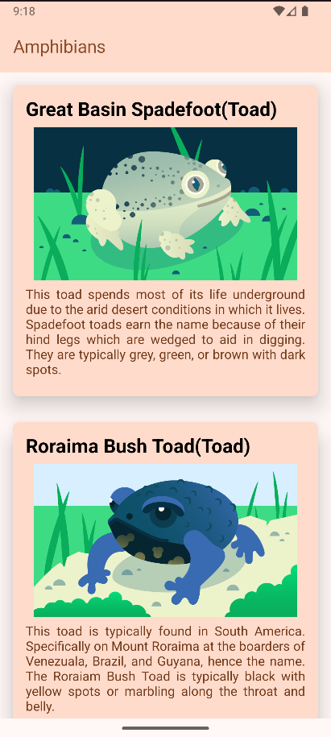

# 🐸 Amphibians App

This is a simple Android application built with **Jetpack Compose** that fetches data from a remote API using **Retrofit** and displays it in a modern UI. The app demonstrates the usage of **Hilt for dependency injection**, **Gson for JSON parsing**, and **Coil for image loading**. It follows the **MVVM architecture** for clean code structure and better scalability.

---

## 🚀 Features

- Fetches animal data (e.g., name, type, description, and image) from a REST API.
- Converts JSON data to Kotlin objects using **GsonConverterFactory**.
- Loads images efficiently using **Coil**.
- Uses **Hilt** for clean dependency injection and avoiding memory leaks.
- Follows **modern Android MVVM architecture** using `ViewModel`, `StateFlow`, and `Composable` UIs.

---

## 🛠️ Tech Stack

- **Kotlin**
- **Jetpack Compose**
- **Retrofit** for API calls
- **Gson** for JSON serialization
- **Hilt** for dependency injection
- **Coil** for image loading
- **MVVM Architecture**

---

## 🧑‍💻 How to Build and Run the App

> You can run this app on any Android emulator or physical device using **Android Studio**.

### ✅ Prerequisites

- Android Studio Hedgehog or higher
- Android SDK version 33 or above
- Minimum Android version set in the project: API 24+
- Stable internet connection (to fetch API data)

### 🧩 Steps to Run the App:

1. **Clone the Repository**

   ```bash
   git clone https://github.com/your-username/amphibians-app.git
   cd amphibians-app
   ```

2. **Open the Project in Android Studio**

   - Launch Android Studio.
   - Click on **"Open"**, then navigate to the cloned folder.

3. **Build the Project**

   - Android Studio will automatically sync the `build.gradle.kts` files.
   - If not, click on **File > Sync Project with Gradle Files**.

4. **Run the App on Emulator or Device**

   - Connect your physical device or create a new **Android Virtual Device (AVD)**.
   - Press **Shift + F10** or click the **Run** ▶️ button.
   - Select the device or emulator to install the app.

---

## 📚 What I Learned

1. How to add and configure **Retrofit** and **Hilt** dependencies in `build.gradle.kts`.
2. How to use **Hilt** to inject dependencies like API services and repositories.
3. How to fetch and load remote images using **Coil**.
4. How to structure an Android project using **modern MVVM architecture** with `ViewModel`, `Repository`, and `UI State`.

---

## 📸 Screenshots

### 🏠 Home Screen


---

## 💡 Author

This app was developed by **Mohit Sharma** as part of learning advanced Android development with real API integration and clean architecture.

---

